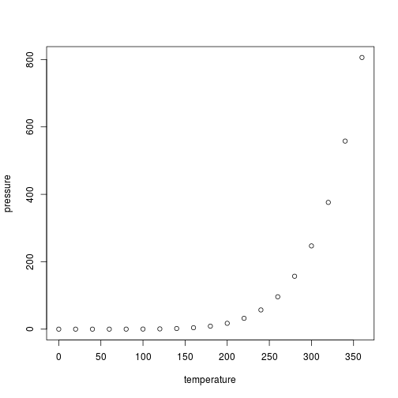

# Introducción

**CubOps** es una aplicación Web que le permitirá operar sobre un conjunto de puntos, típicamente estaciones meteorológicas, cada uno de los cuales contiene infromación temporal de un número finito de variables, como pueden ser, precipitación, temperaturas mínimas y máximas.

En general, el sistema trabaja con puntos a los que se le ha asociado un número de variables cualquiera, que dependen de una fecha secuencial en días.

Para el análisis y la aplicación de operaciones o producción de algunos gráficos, el sistema permite generar una tabla completa para una variable seleccionada, cada una de cuyas columnas corresponde a cada uno de los puntos o estaciones de la base de datos. Posteriormente, se pueden aplicar operaciones estadísticas (media, rango, mediana, _quantile_, etc.), a los datos de la columna, o a una selección de esta de acuerdo con las fechas establecidas. El sistema también permite la producción de varios tipos de gráficos simples para las columnas de las tablas resultantes, a saber: histogramas, _boxplots_, o series de tiempo.

En cualquier momento, el usuario puede descargar las tablas resultantes de sus operaciones en un formato estándar (csv), que podrá ser leído fácilmente por hojas de cálculo, tales como _LibreOffice Calc_, o _Excel_, o por otros sistemas o programas para desarrollar procesos adicionales con la información.


```r
summary(cars)
```

```
##      speed           dist    
##  Min.   : 4.0   Min.   :  2  
##  1st Qu.:12.0   1st Qu.: 26  
##  Median :15.0   Median : 36  
##  Mean   :15.4   Mean   : 43  
##  3rd Qu.:19.0   3rd Qu.: 56  
##  Max.   :25.0   Max.   :120
```

# Los datos y su recolección

You can also embed plots, for example:



Note that the `echo = FALSE` parameter was added to the code chunk to prevent printing of the R code that generated the plot.
